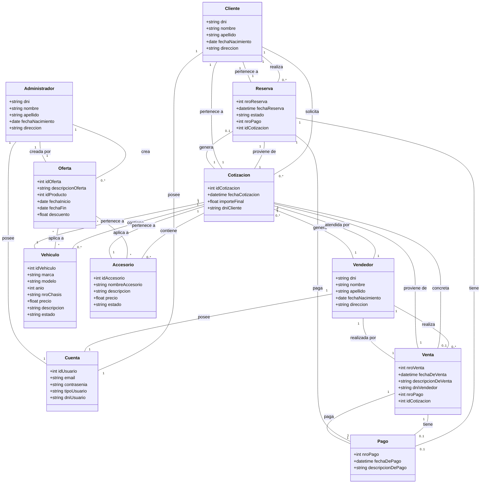
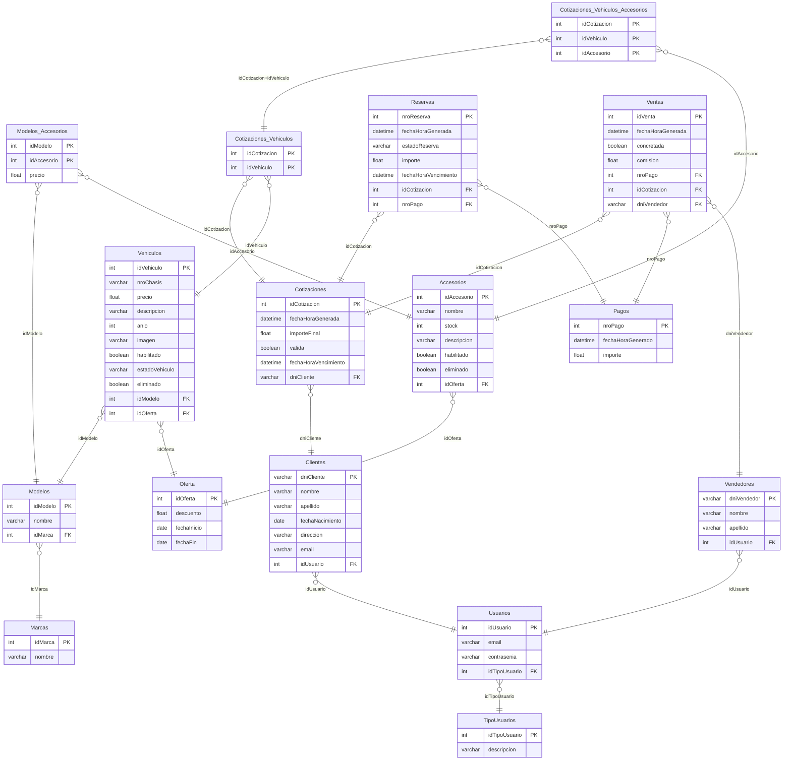

# 🚗 FLY Car - Car Dealership Management System

A PHP MVC application for managing a car dealership, including vehicle quotes, reservations, and sales.

## Features

- **User Management**: Clients, Sellers, and Administrators
- **Quote System**: Generate quotes for vehicles with accessories
- **Reservation System**: Reserve vehicles with a deposit
- **Sales Management**: Complete sales with commission tracking
- **Offer Management**: Apply discounts to vehicles and accessories

## Tech Stack

- **Backend**: PHP 8+ (Laravel-style MVC)
- **Database**: MySQL / MariaDB
- **Server**: WAMP (Windows, Apache, MySQL, PHP)
- **Frontend**: HTML5, CSS3, JavaScript, jQuery, Bootstrap 5

## Project Status

🚧 Under Development

---

## Installation

### Prerequisites
- [WAMP Server](https://www.wampserver.com/) (Windows) or XAMPP
- PHP 8.0+
- MySQL 5.7+ or MariaDB

### Steps

1. **Clone the repository**
   ```bash
   git clone https://github.com/Prohibidou/buyacar.git
   cd buyacar
   ```

2. **Move to WAMP www folder**
   ```bash
   # Copy project to: C:\wamp64\www\buyacar
   ```

3. **Start WAMP Server**
   - Ensure Apache and MySQL are running (icon should be green)

4. **Create Database**
   - Open phpMyAdmin: `http://localhost/phpmyadmin`
   - Create database: `concesionaria_laravel`
   - Import file: `database/schema.sql`

5. **Access the Application**
   - Open: `http://localhost/buyacar/`

### Default Users

| Role | Email | Password |
|------|-------|----------|
| Admin | admin@flycar.com | password |
| Seller | vendedor@flycar.com | password |
| Client | cliente@test.com | password |

---

## Class Diagram (G1 Domain Model)


---

## Database Diagram (G1 Data Model)



## License

MIT License
